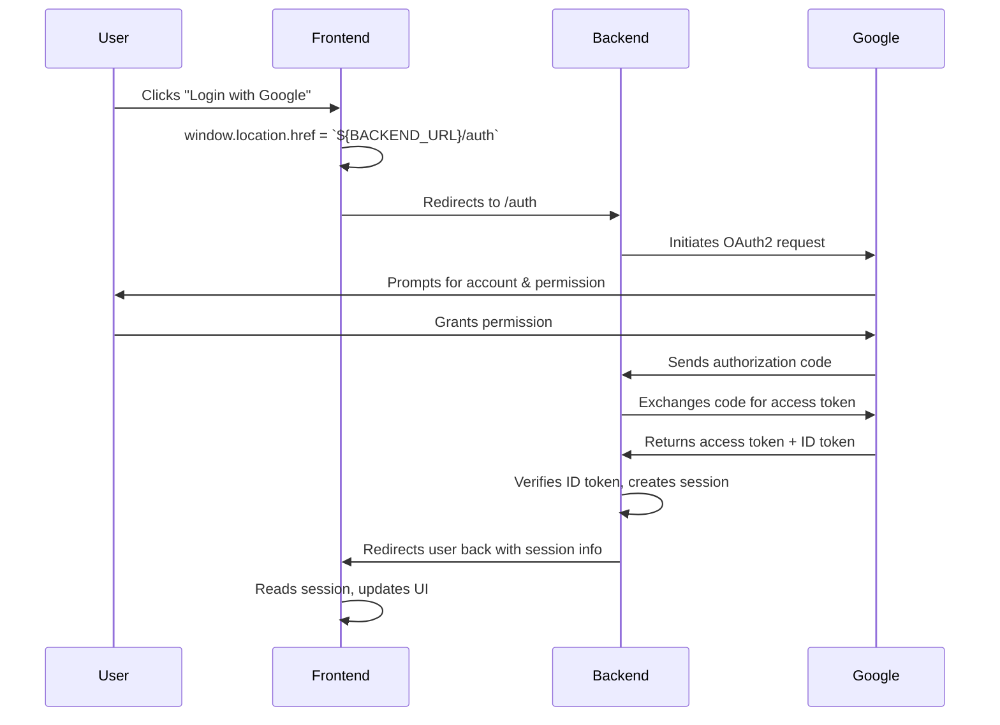

# 🌐 Creator Hub Web

A Next.js frontend integrated with backend OAuth2 login via Google. This app initiates authentication flows on the client and delegates token handling to the backend server.

---

## 🔐 Google OAuth2 Authentication Workflow



---

## 📦 Environment Configuration

Make sure to set this in your `.env.local`:

```env
NEXT_PUBLIC_BACKEND_URL=http://localhost:8080
```

Restart the development server after changing this file.

---

## 🚀 Local Development

```bash
npm install
npm run dev
```

Visit `http://localhost:3000` to start using the app.

---

## 🛠 Tech Stack

- **Frontend**: Next.js, React, Tailwind CSS
- **Auth Strategy**: Google OAuth2 (via backend redirect)
- **Env Management**: `.env.local` with public variables
- **Deployment**: Vercel or custom Node.js server

---

## 🧪 How to Test Auth

1. Click the login button on the homepage.
2. You’ll be redirected to the backend `/auth` endpoint.
3. Authenticate via Google.
4. You’ll return logged in with an active session.